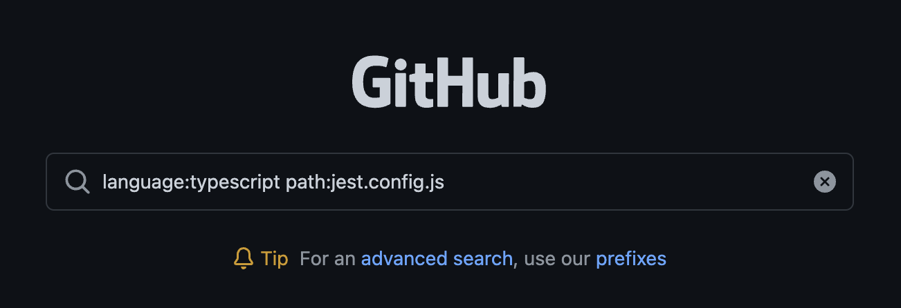

Contextual Based Code Search is a phrase (I think) I'm coining that makes searching through code much more useful.

I'm sure you've used Github Search in the past. I think it's one of the best ways to learn how people write code.
Not only am I always poking around a codebase, I'm also (frantically) using it to search for solutions.




Github Search on its own, is much more powerful when you start using filters like language, path, filename, etc:

```sh
language:typescript path: src/index.ts return res.send(202)
```

This one feature helps you narrow down the specific language and repo structure (a la path) for the code example you're looking for. That is really great.

That being said, what if you need more context? What about more nuanced examples? What happens when I want to search for something like:

"Find all places that call return res.send(202)":

- in a monorepo using turbo?
- in a Deno application?
- Using ESM (Node's new modules)?
- in a monorepo that includes an expo app?

This is where the idea for Contextual Based Code Search comes from.

I would love to be able to write a query like "An example using turbo, expo, jest in a monorepo".

The results should return the same format Github search returns, with a variety of _real-world_ repos that are using all of the technologies I'm looking for, in the specific environment I'm looking for.

You might counter and say "just check out a boilerplate". There are plenty of boilerplates out there.

Typically they fall out of date, get something wrong, use a different package manager, etc.

Most importantly, boilerplates are not used in production. Having multiple examples from real-world open-source projects, I believe, is the key to solving an engineer's problem.

It's not often that the first StackOverflow answer returns exactly what you need.
